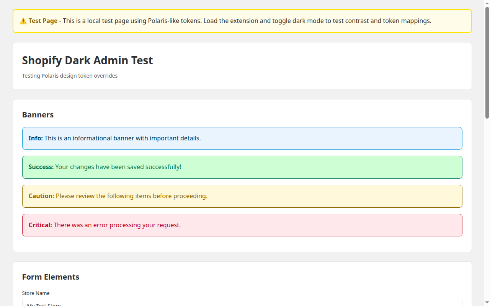

# Shopify Dark Admin

A Chrome extension (Manifest V3) that adds a beautiful dark mode to the Shopify admin (admin.shopify.com).

> **⚠️ V1 Status:** This is the initial V1 release. Token mappings are based on Polaris documentation and need real-admin verification. See [Known Issues](#known-issues).

## Features

- 🌙 **True Dark Mode** – Overrides Polaris design tokens for consistent dark theming
- ⚡ **Instant Toggle** – Switch themes with no page reload required
- 🖥️ **System Theme Support** – Automatically follows your OS dark/light preference
- 🔒 **Privacy First** – No network requests, no analytics, no data collection
- 🎯 **Zero Flash** – Dark mode applies at `document_start` for smooth page loads

## Installation

### Load Unpacked (For Testing)

1. **Download or clone this repository**
   ```bash
   git clone https://github.com/UribeJr/shopify-dark-admin.git
   cd shopify-dark-admin
   ```

2. **Open Chrome Extensions page**
   - Navigate to `chrome://extensions/`
   - Enable "Developer mode" (toggle in top right)

3. **Load the extension**
   - Click "Load unpacked"
   - Select the `extension` folder from this repository
   - The extension icon should appear in your toolbar

4. **Visit Shopify Admin**
   - Go to `https://admin.shopify.com/`
   - Click the extension icon to toggle dark mode

### Chrome Web Store

🚧 Coming soon! Extension will be published to the Chrome Web Store after real-admin testing.

## Usage

### Toggle Dark Mode

1. Click the extension icon in your Chrome toolbar
2. Select your preferred mode:
   - **On** – Always use dark mode
   - **Off** – Always use light mode
   - **System** – Follow your OS theme (default)

### Dump Current Tokens (For Developers)

To help improve token accuracy, Enrique can run the token dumper script:

1. Open the Shopify admin in Chrome
2. Open DevTools (F12 or Cmd+Option+I)
3. Go to the Console tab
4. Copy and paste the entire contents of `scripts/dump-tokens.js`
5. Press Enter
6. Copy the JSON output from the console
7. [Create an issue](https://github.com/UribeJr/shopify-dark-admin/issues) with the token dump

This helps us map the actual Polaris tokens used in production.

## Screenshots

### Test Page (Light Mode)

*Test page using Polaris-like tokens in light mode*

### Test Page (Dark Mode)
> 📸 **Dark mode screenshot pending** – Chrome headless had issues capturing the dark variant. The dark mode CSS is fully implemented and can be tested by loading the extension and toggling dark mode on the test page.

> **Note:** Screenshots above show a local test page. Real Shopify admin screenshots will be added after Enrique's testing.

## V1 Scope

This V1 release covers:

- ✅ Core admin pages: Home, Orders, Products, Customers, Discounts, Analytics, Settings
- ✅ Data tables and lists
- ✅ Forms and inputs
- ✅ Modals and popovers
- ✅ Banners and notifications
- ✅ Left navigation consistency
- ✅ Rich text editor support
- ✅ System theme detection

### Not Yet Covered (V2)

- ⏳ Embedded app iframes (third-party apps)
- ⏳ Theme picker (OLED black, Win98 retro theme)
- ⏳ Fine-tuning per Enrique's feedback

## Known Issues

### Token Accuracy
- 🔧 **Token mappings are based on Polaris docs** – Initial color mappings are derived from public Polaris documentation. Some tokens may not perfectly match the live admin until we receive Enrique's token dump.

### Potential Issues
- ⚠️ **Illustrations** – Some admin illustrations may appear dim. Product photos are intentionally excluded from dimming.
- ⚠️ **Third-party apps** – Embedded apps load in iframes from other domains. V1 doesn't inject into these iframes. V2 will add opt-in support.
- ⚠️ **Theme editor** – The theme editor canvas is excluded in V1 as it contains storefront preview content.
- ⚠️ **Hard-coded colors** – Some UI elements may use inline styles or hard-coded colors not using Polaris tokens. We've added fallback rules, but some may slip through.

### Reporting Issues

Found a white-on-white text issue or other problem? Please:

1. [Open an issue](https://github.com/UribeJr/shopify-dark-admin/issues/new)
2. Include:
   - Screenshot of the problem
   - Page URL (e.g., admin.shopify.com/store/your-store/orders)
   - Browser/OS version

## Development

### Project Structure

```
shopify-dark-admin/
├── extension/
│   ├── manifest.json         # Extension manifest (Manifest V3)
│   ├── content/
│   │   ├── content.js        # Content script - applies dark mode class
│   │   └── dark.css          # Dark mode token overrides
│   ├── popup/
│   │   ├── popup.html        # Extension popup UI
│   │   └── popup.js          # Popup logic
│   └── icons/                # Extension icons (16, 32, 48, 128px)
├── scripts/
│   ├── dump-tokens.js        # Token dumper for DevTools console
│   └── generate-icons.js     # Icon generator
├── test/
│   └── test-page.html        # Local test page with Polaris tokens
├── docs/
│   └── screenshots/          # Screenshots
└── README.md
```

### Token Mapping

All color overrides are in `extension/content/dark.css` and scoped under `html.sda-dark`. The token structure follows Polaris conventions:

```css
html.sda-dark {
  --p-color-bg: #1a1a1a;               /* Page background */
  --p-color-bg-surface: #242424;        /* Card/surface background */
  --p-color-text: #e6e6e6;             /* Primary text */
  --p-color-text-secondary: #a3a3a3;   /* Secondary text */
  --p-color-border: #404040;           /* Border color */
  /* ...and many more */
}
```

To update tokens after receiving Enrique's dump:

1. Paste the JSON from `dump-tokens.js` into a file
2. Review the `tokens` object for current values
3. Update `dark.css` with appropriate dark-mode equivalents
4. Test on the local test page first
5. Have Enrique test on the real admin

### Local Testing

1. **Open the test page**
   ```bash
   open test/test-page.html
   # or just open it in Chrome
   ```

2. **Load the extension** (see [Installation](#installation))

3. **Toggle dark mode** using the extension popup

4. **Check for issues**
   - Text contrast (WCAG AA minimum)
   - Button states (hover, active, disabled)
   - Input focus states
   - Table row hovers
   - Modal backgrounds

### Building for Production

The extension is plain JS/CSS, so no build step is required. To package:

```bash
cd extension
zip -r shopify-dark-admin.zip . -x "*.DS_Store"
```

## Permissions

This extension requires minimal permissions:

- **`storage`** – To save your theme preference (syncs across devices)
- **`host_permissions: ["https://admin.shopify.com/*"]`** – To inject the dark mode stylesheet

**No other permissions.** No network access, no analytics, no data collection.

## Contributing

Contributions welcome! Please:

1. Fork the repository
2. Create a feature branch (`git checkout -b feature/amazing-feature`)
3. Commit your changes (`git commit -m 'Add amazing feature'`)
4. Push to the branch (`git push origin feature/amazing-feature`)
5. Open a Pull Request

## License

MIT License - see [LICENSE](LICENSE) file for details.

## Credits

- **Design System:** Built on [Shopify Polaris](https://polaris.shopify.com/) design tokens
- **Concept:** Inspired by the need for a dark mode during late-night Shopify admin work
- **Maintainer:** Enrique Uribe ([@UribeJr](https://github.com/UribeJr))

## Changelog

### V1.0.0 (October 9, 2026)

- 🎉 Initial release
- ✅ Core dark mode token overrides
- ✅ Instant toggle (On/Off/System)
- ✅ Chrome Manifest V3 support
- ✅ Zero-flash dark mode injection
- ⚠️ Token mappings based on Polaris docs (needs real-admin verification)

---

**Made with ☕ for late-night Shopify builders**
